::: audience
**Target audience** Wi-Fi operators
:::

# Introduction

0WM Client is the mobile survey frontend for 0WM. It uses WebXR to track the device’s movement and combines that information with Wi-Fi scan data fetched from an access point. While the project is still in its early stages, the client already provides the basis to perform precise Wi-Fi field surveys.

If you do not have any special equipment to conveniently connect and hold your phone and access point, you may be interested in consulting the [0WM-Models repository](https://github.com/lab0-cc/0WM-Models), which provides 3D models that you can print yourselves.

# Getting started

The client welcomes you with a screen asking to click on a button to start (this is required by modern browsers’ security policies). On iOS, the interface quickly redirects you to Apple’s website to open 0WM Client through a tiny App Clip (as Safari is missing a few required features). After clicking, the client connects to the 0WM access point (it first tries `ap.local`, then successively the access points configured on the server) and communicates with its radios.

::: phone
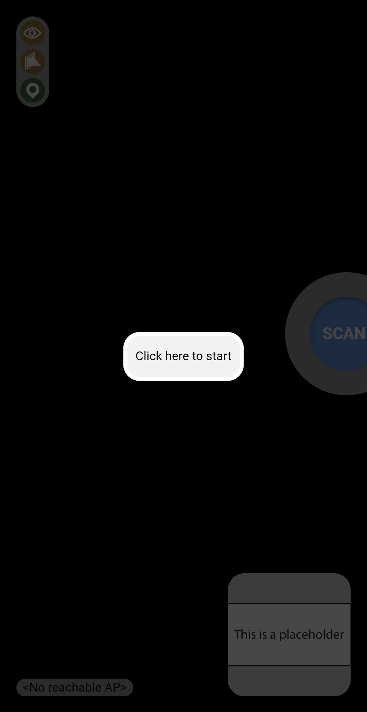

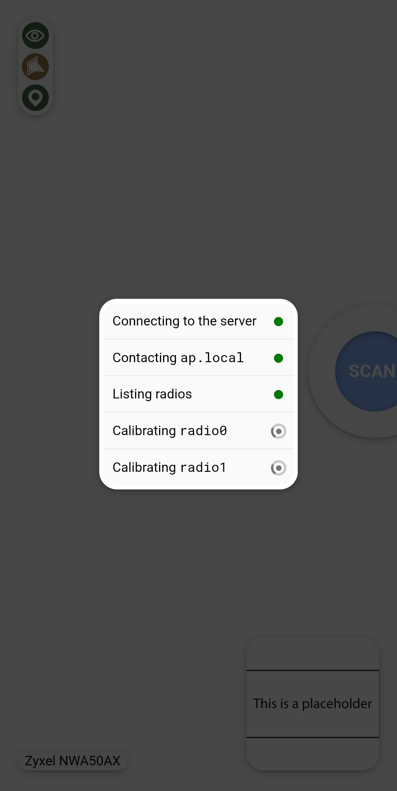

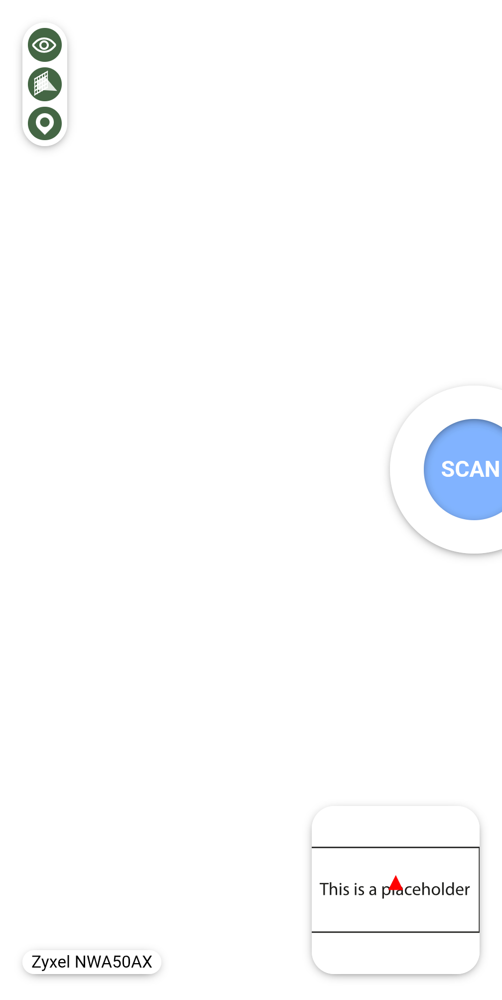
:::

## Configuring the map

There is a mini-map at the bottom-right corner of the screen which locates you on a floorplan [previously added in 0WM OpMode](guide-opmode.md#adding-a-floorplan). Clicking this mini-map expands it and offers options to modify the current flooplan (by default, no floorplan is selected).

### Floorplan selection

Clicking the floorplan selection dropdown provides a list of floorplans sorted by distance (as reported by your phone’s GPS module). To select a floorplan, simply click it (it should show a green dot if you appear to be within its boundaries [configured in the OpMode](guide-opmode.md#floorplan-editor)).

::: phone
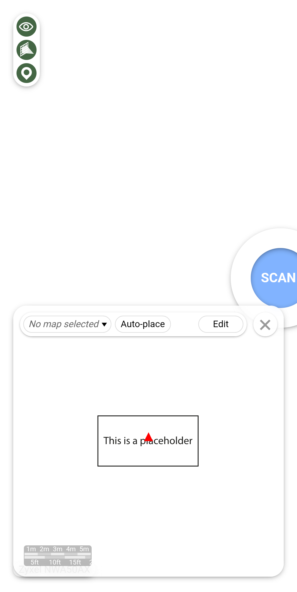

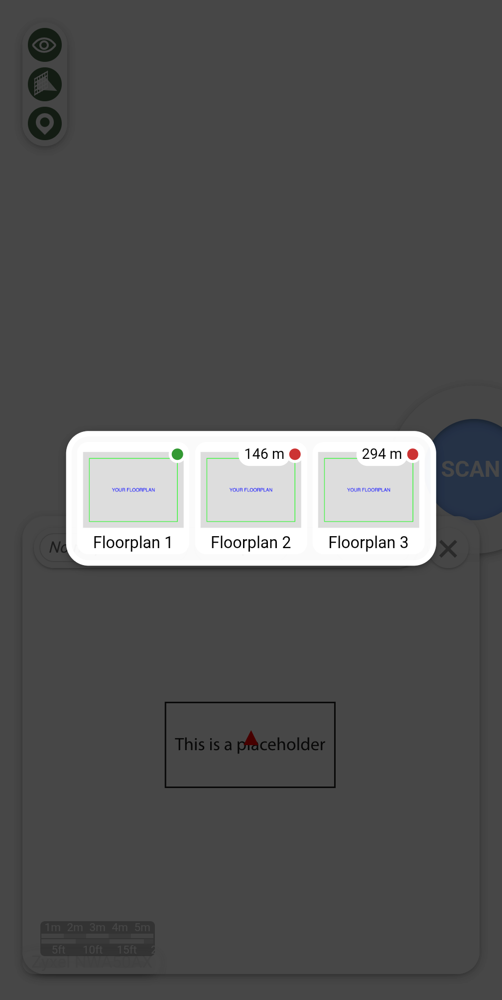

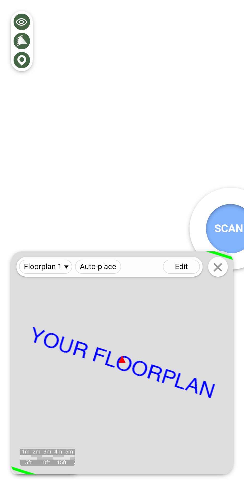
:::

### Automatic placement

Currently, the floorplan placement is a manual process, but future versions of the client will allow using your phone’s wall detection sensors to precisely locate you within a building.

::: phone
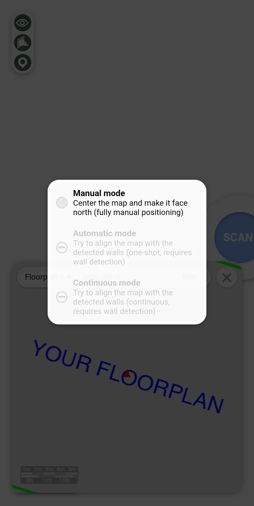

:::

### Manual placement

Once a floorplan is selected, it is shown on the mini-map so that you are at its center, and oriented to face north, as [placed in the OpMode](guide-opmode.md#map-editor). Clicking the “Edit” button allows you to move the floorplan with one finger or move and rotate it with two fingers (in case your phone cannot perfectly find the Geographic North). It is not possible to zoom or skew the floorplan, as its dimensions and geometry are directly inherited from the OpMode. Once you are done editing the floorplan, click “Ok”. The mini-map can then be closed using the X button.

::: phone

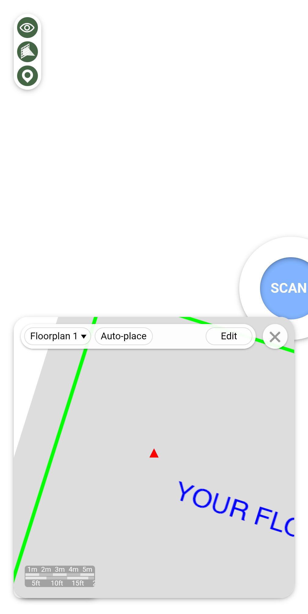
:::

## Performing measurements

To perform a measurement, click the “SCAN” button and hold still while the 0WM access point radios are scanning the environment. Once this is done, the mini-map will update a heatmap of all the measurements done is this session. All the data is synchronized to the 0WM server, so once the survey session is finished, you can safely close the web application.

::: phone
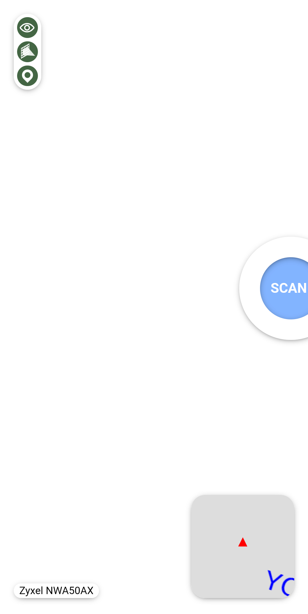

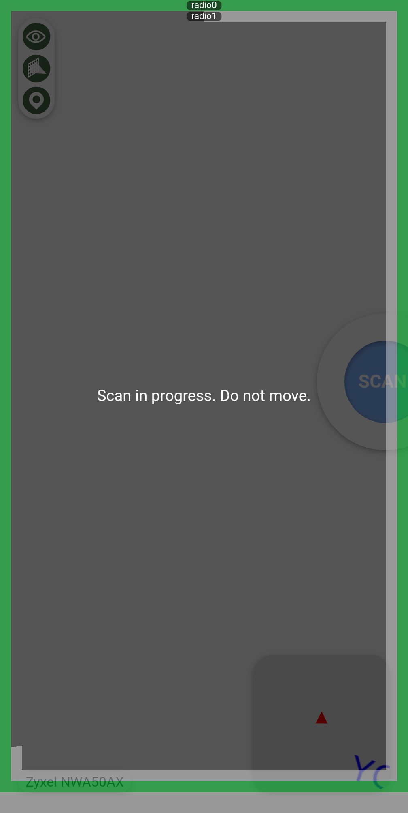
<!-- This is a Chrome bug that only appears in instrumentation -->

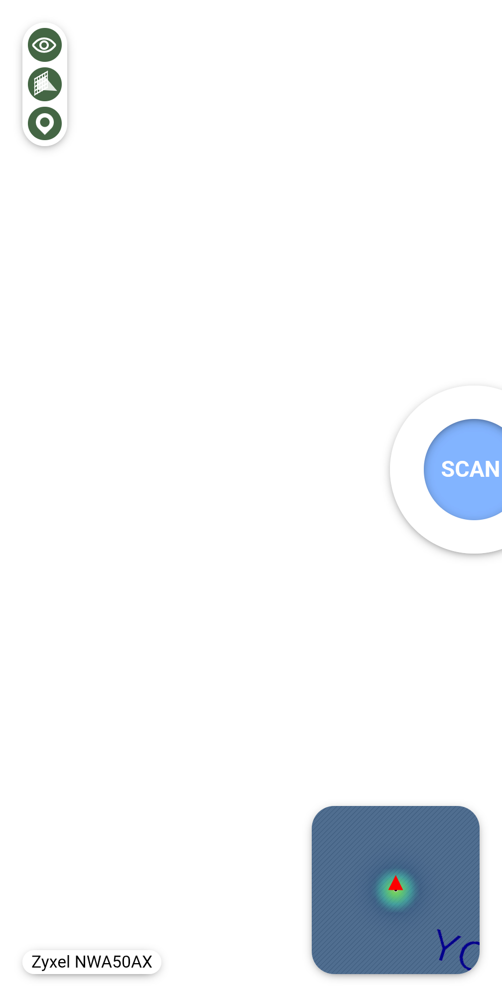
:::

*Background image from [Declan Sun](https://unsplash.com/fr/@declansun), available on [Unsplash](https://unsplash.com/photos/jdsSkQNTPuo) under the [Unsplash license](https://unsplash.com/license).*
