::: audience
**Target audience** Wi-Fi operators
:::

# Introduction

0WM OpMode is the operator dashboard for managing Wi-Fi surveys. It is currently used to upload floorplans, edit their boundaries and walls, georeference them on a world map, and send metadata to the 0WM Server. While the project is still in its early stages, the operator mode already provides all the tools to properly prepare Wi-Fi field measurements.

# Getting started

The first time the operator mode is accessed, you are welcomed with an empty world map centered on Brest, France. The map can be navigated to your desired location, but as soon as floorplans are uploaded, the map will center on them by default.

::: center
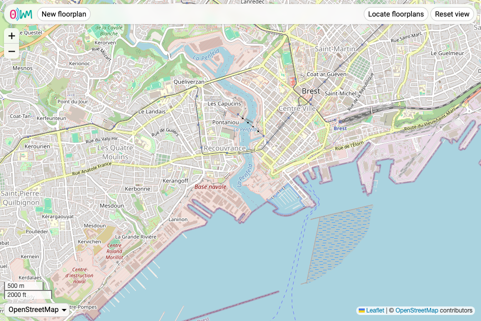{.single}
:::

## Adding a floorplan

To add a new floorplan, simply click the “New floorplan” button. You are prompted to import a floorplan image (JPEG, PNG, or WebP), which you later can edit and place on the map. At any time, you can cancel to return to the main view by clicking the “Cancel” button.

The floorplan interface offers 3 tabs:

* [Floorplan Editor](#floorplan-editor)
* [Map Editor](#map-editor)
* [Additional Parameters](#additional-parameters)

### Floorplan editor

The floorplan editor allows to add walls and boundaries to the floorplan. It is necessary to define at least one boundary (with the {.inline} button), as it is used to determine what is considered to be inside or outside the building or room you are adding. The {.inline} button allows to define walls, used for heatmap generation.

::: center
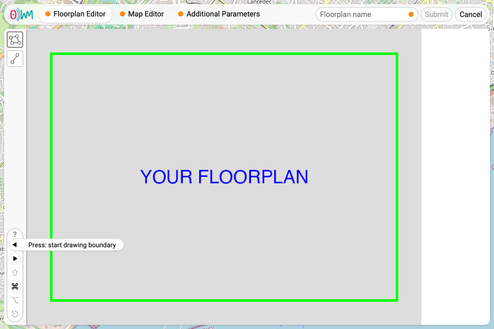{.single}
:::

Indicators tell you exactly what you can do to interact with the floorplan, with the following pictograms:

* []{style="display:inline-block;background:#0000;border:6px solid #0000;border-right:10px solid #000;margin-left:-5px;margin-right:1px"}, for left click;
* []{style="display:inline-block;background:#0000;border:6px solid #0000;border-left:10px solid #000;margin-left:1px;margin-right:-5px"}, for right click;
* ⇧, for the shift key;
* ⎈ / ⌘ (on macOS), for either the control, command, or meta key;
* ⎇  / ⌥ (on macOS), for either the alt or the option key;
* ⎋, for the escape key.

Once at least one boundary is defined, the tab’s orange dot disappears, indicating that the floorplan is valid.

::: center
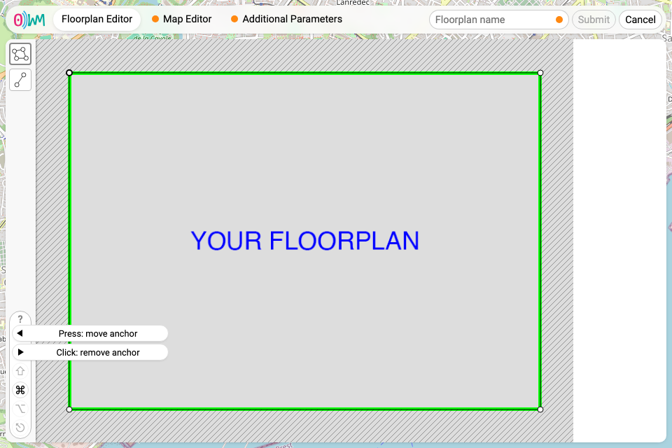{.single}
:::

### Map editor

Placing the floorplan on the world map requires placing anchors on both of those, in a process called georeferencing. First, the anchors marked [1]{.anchor .one}, [2]{.anchor .two} and [3]{.anchor .three} need to be positioned (by dragging and dropping them) at reference points easy to position on the map, usually corners.

::: center
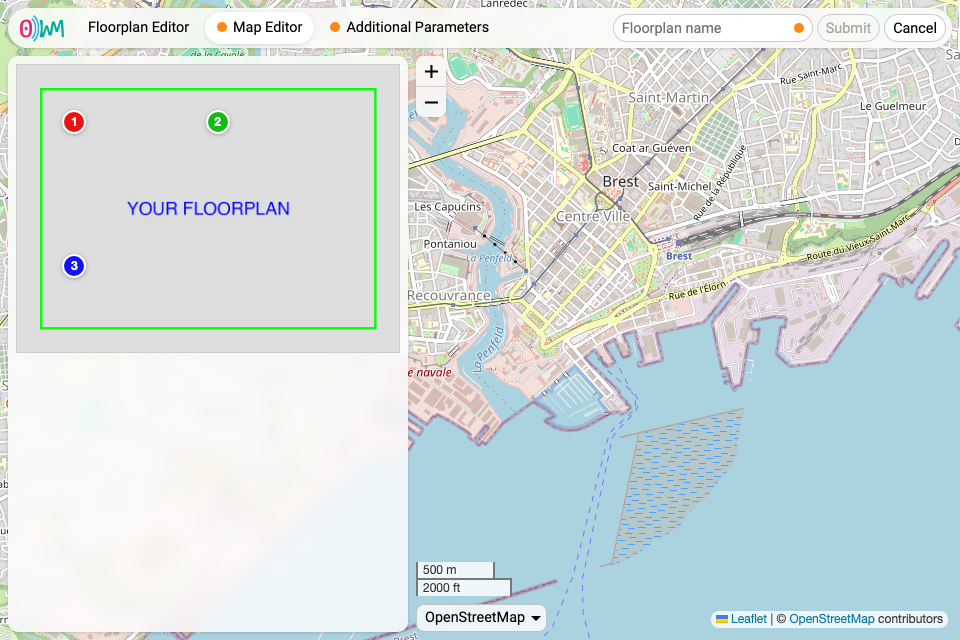{.pair}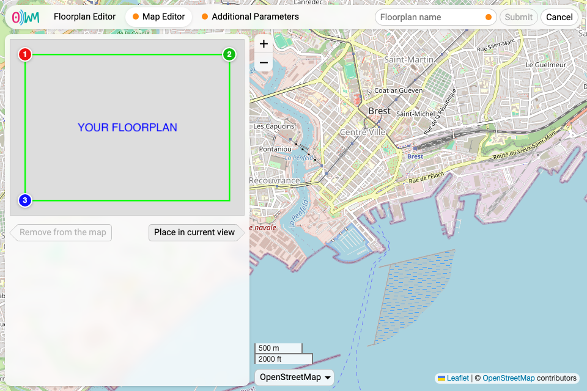{.pair}
:::

Then, the map needs to be moved and zoomed to where you want to place the floorplan. The floorplan can be placed by clicking the “Place in current view” button.

::: center
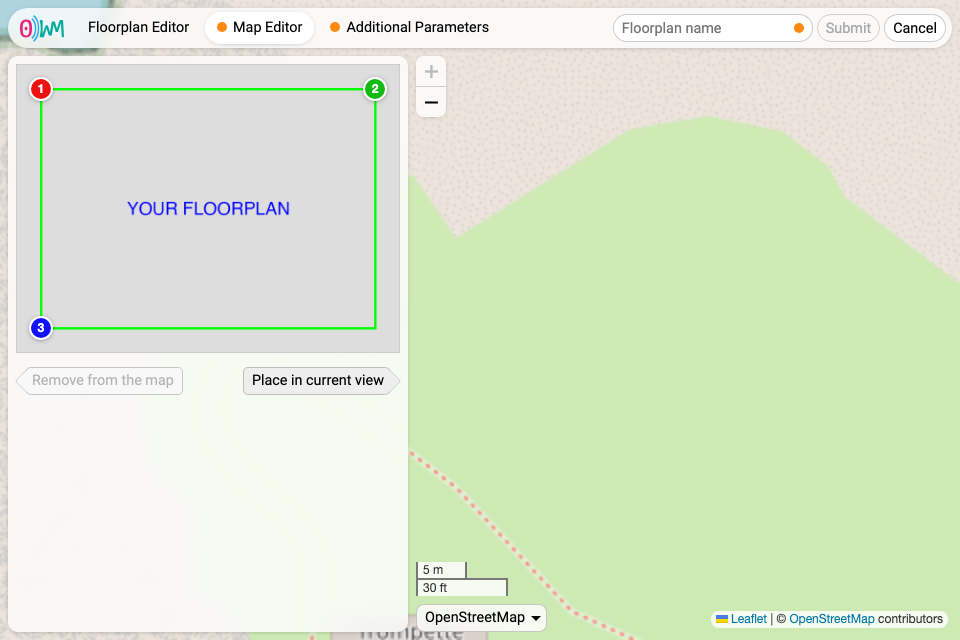{.pair}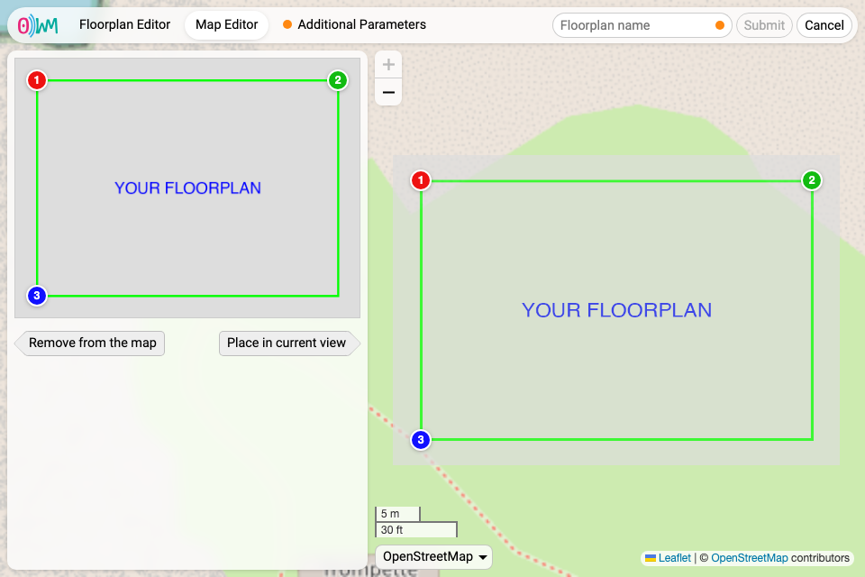{.pair}
:::

Finally, the corresponding [1]{.anchor .one}, [2]{.anchor .two} and [3]{.anchor .three} anchors can be moved on the world map to correctly position the floorplan.

::: center
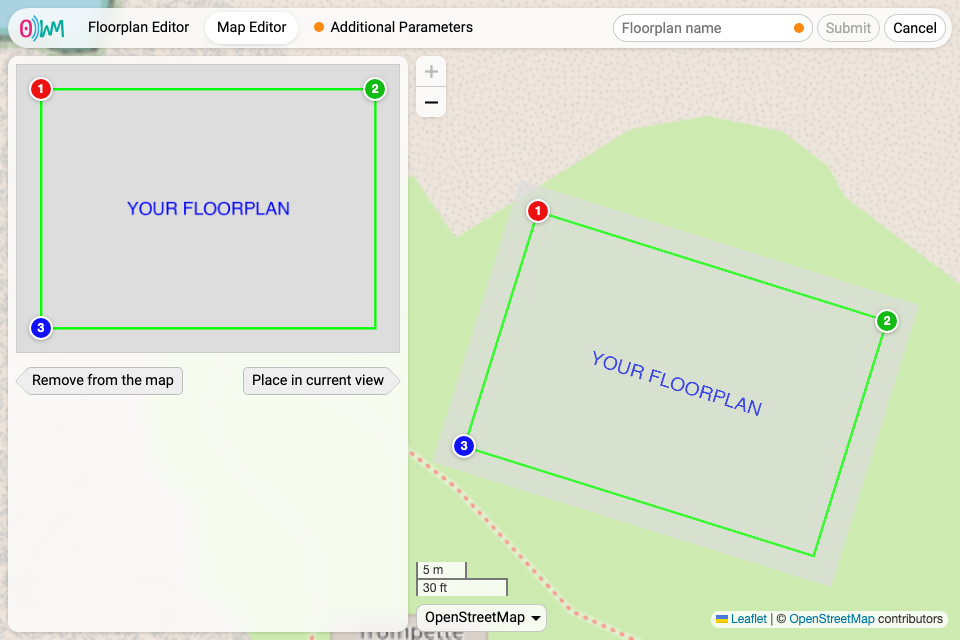{.single}
:::

Once the floorplan is placed on the world map, the tab’s orange dot disappears.

### Additional parameters

The last tab asks for altitude data, which need to be filled. Once this is done, the tab’s orange dot disappears. To submit the floorplan, it needs to be named, then the “Submit” button becomes clickable.

::: center
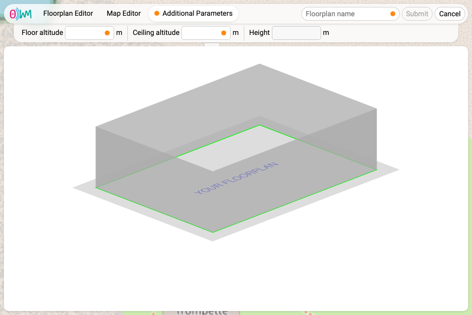{.pair}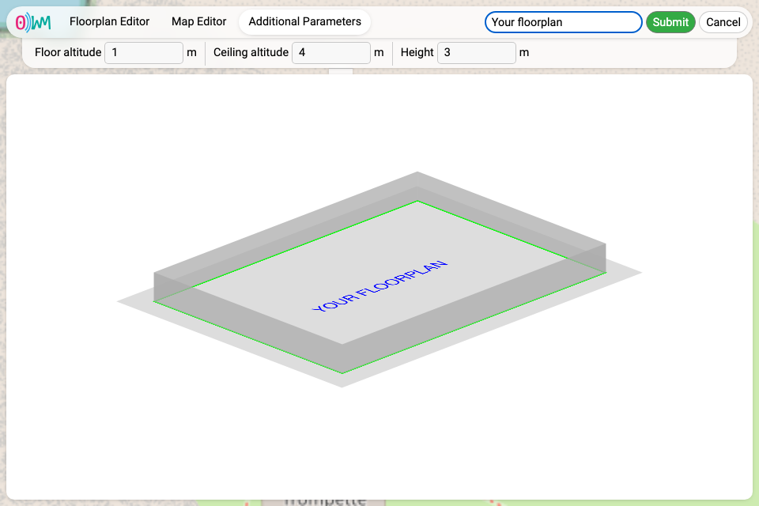{.pair}
:::

You are then shown again the main view, this time with your new floorplan.

::: center
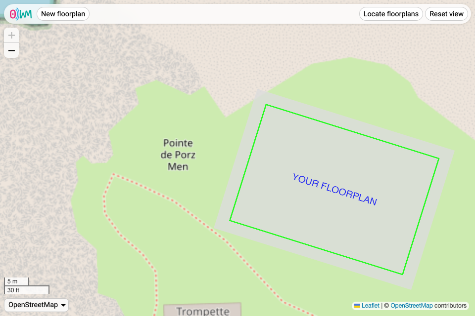{.single}
:::

## Editing and removing a floorplan

Once a floorplan has been uploaded, hovering it on the world map reveals two buttons, one to edit the floorplan, and another one to delete it.

::: center
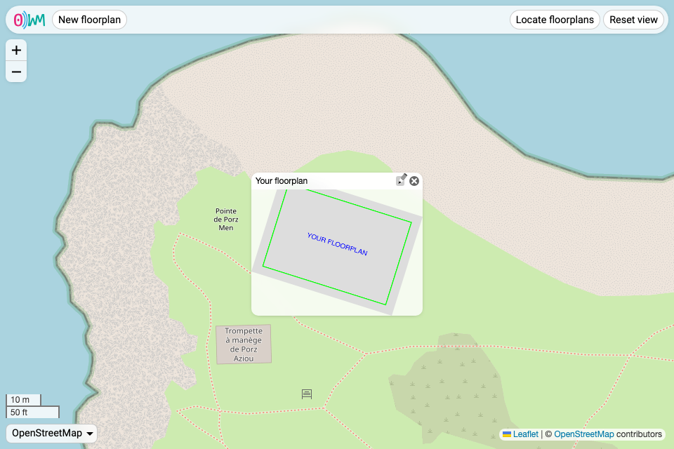{.single}
:::

# Navigating the interface

## Interacting with the map

The interface allows to move the world map by dragging it with your mouse or with directional arrows, to zoom it with either your mouse wheel, scroll and zoom touch gestures, or the “+” and “−” buttons, and to change the map provider. Currently, we support the following providers:

* [OpenStreetMap](https://openstreetmap.org);
* [CartoDB](https://carto.com);
* [IGN](https://ign.fr), both map and satellite.

::: note
In the future, the providers will be configurable on the server side.
:::

## Locating floorplans

Two buttons help in case you get lost in the world map:

* “Locate floorplans”, to quickly highlight floorplans both in and out of view;
* “Reset view”, to reset the view to its initial state.

::: center
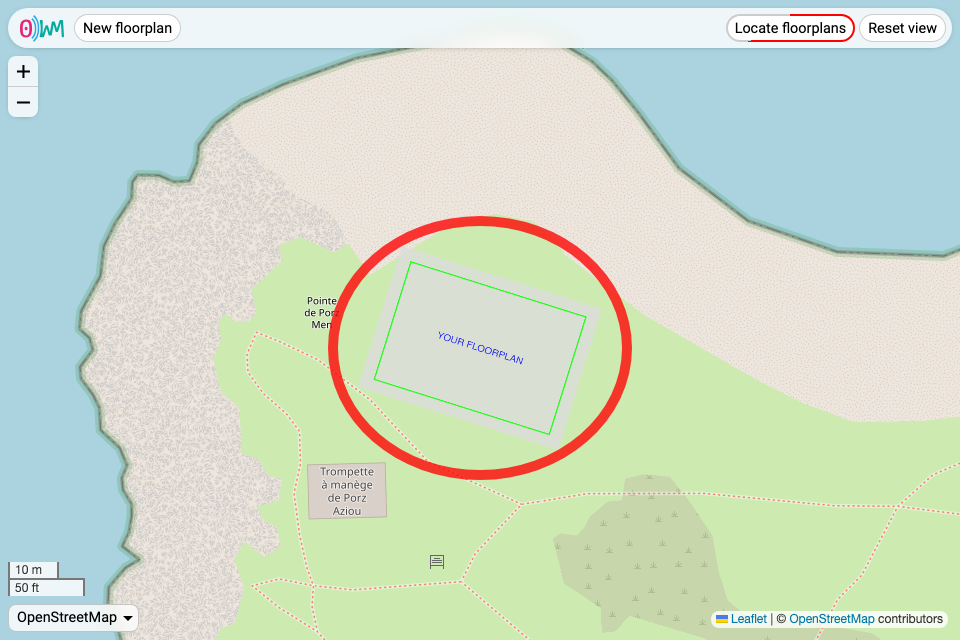{.single}
:::
